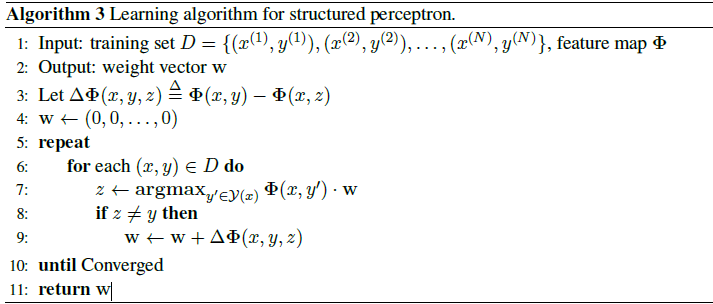
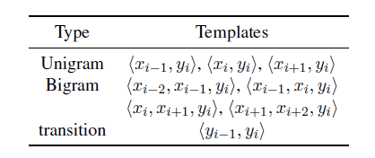

# nlp-minitools
## Named Entity Recognition 

### Algorithm

#### structured perceptron

#### features

#### Viterbi Decode

There are different decode methods such as dynamic programming and beam search. I used **dynamic programming**, which is often called **Viterbi-decode**, to predict the output labels. 

#### Latent Variables

Then I used latent variables. I replaced ‘I-XXX’ label by ‘I-XXX’ or ‘E-XXX’. The ‘E-XXX’ means the end of the location, person name, or organization. So there are 10 labels in output set Y. 

### results

| **Iteration** | **averaged** | **Latent  var** | **precision** | **recall** | **F1** |
| ------------- | ------------ | --------------- | ------------- | ---------- | ------ |
| **1**         | yes          | yes             | 85.58         | 75.73      | 80.35  |
| **5**         | yes          | yes             | 89.47         | 85.37      | 87.37  |
| **10**        | yes          | yes             | 90.44         | 86.78      | 88.57  |
| **20**        | yes          | yes             | 90.86         | 87.14      | 88.96  |

## Semantic Dependency Parsing

> Zhang X, Du Y, Sun W, et al. Transition-based parsing for deep dependency structures[J]. Computational Linguistics, 2016.

I used two-stack transition system. All details are in the paper.